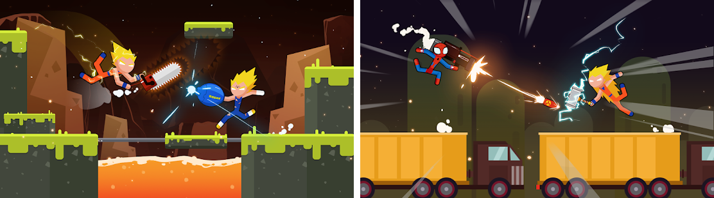
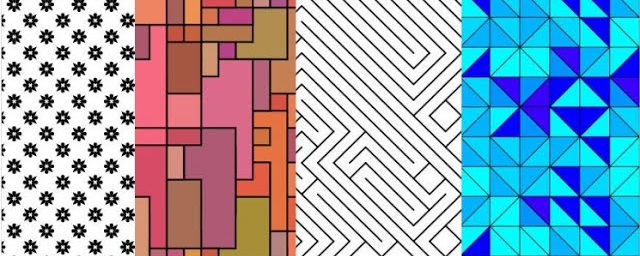
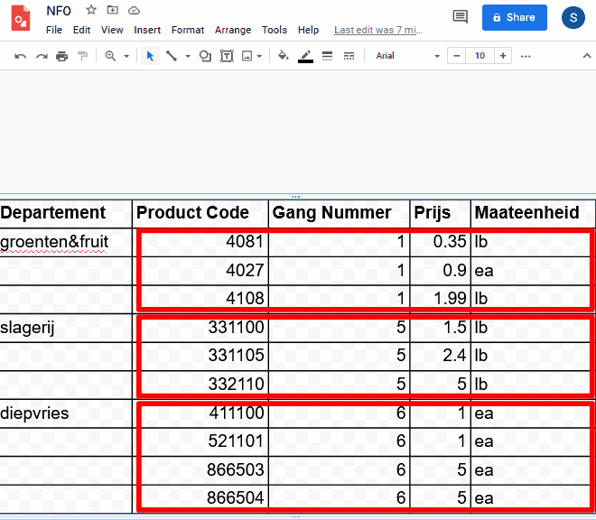

# 💻 PROJECT: SD1 - Object Oriented Fight Scene

- [💻 PROJECT: SD1 - Object Oriented Fight Scene](#-project-sd1---object-oriented-fight-scene)
  - [🥅 Overzicht en Leerdoelen](#-overzicht-en-leerdoelen)
  - [🔍 Object Oriented Fight Scene](#-object-oriented-fight-scene)
  - [🛠️ Opdrachten](#️-opdrachten)
  - [💡 Belangrijke Termen](#-belangrijke-termen)
  - [🔒 **Minimale Vereisten**](#-minimale-vereisten)
  - [🏆 **Evaluatie**](#-evaluatie)
    - [Instructies](#instructies)
    - [Codeblokken](#codeblokken)
    - [Datastructuren](#datastructuren)
    - [Basiskennis](#basiskennis)

## 🥅 Overzicht en Leerdoelen

 - tijd: **10u**
 - start: **25 oktober**
 - einde: **14 november** (deadline)
 - onderwerp:
   - **klassen**
   - **objecten**
   - **codeblokken**

Met dit project ga je aan de slag met de p5-play-OO en p5.js libraries. Je leert te programmeren in een object-georienteerde omgeving programmeren. Je maakt gebruik van klassen en objecten om je project te structureren. Je maakt gebruik van iteraties, sequenties en selecties om je klassen in te vullen.

## 🔍 Object Oriented Fight Scene

Je gaat in groepjes van 2 leerlingen een moment-opname in een stick-figure vechtscene maken. Elke leerling maakt een personage en een wapen dat hun personage gebruikt.

Hieronder zie je twee voorbeelden van zo'n stick-figure vechtscene.

Jullie zorgen samen voor een achtergrond waar het gevecht plaatsvindt. Je achtergrond bestaat uit een uniek patroon en minstens 4 verschillende soorten objecten.

Dit **uniek patroon** dat je maakt is verschillend van de patronen die we tijdens de les hebben gemaakt. Hetzelfde patroon in een andere kleur of lijndikte wordt dus niet goed gerekend.

Hieronder zie je enkele voorbeelden van patronen die je kunt maken met p5.js. Jouw patroon moet zeker niet zo complex zijn, maar teken het op voorhand uit, dat maakt je werk een stuk gemakkelijker!

> ⚠️ **OPGELET!** Hou er rekening mee dat je voor elke groepsopdracht andere groepsgenoten moet vinden. Werk je voor deze opdracht dus samen met Joske Vermeulen, zal je later niet meer met Joske Vermeulen mogen samenwerken.

## 🛠️ Opdrachten

Theorie: Vul de definities en termen in

> - [ ] Vul onderaan dit document een definitie in voor elke term. De 3 vraagtekens mag je verwijderen.
>   - Gebruik de cursus om een goede defnitie te vinden.

---

Opdracht 0: volg de tutorial

> - [ ] Installeer de VS Code Extension genaamd [CodeTour](https://marketplace.visualstudio.com/items?itemName=vsls-contrib.codetour)
> - [ ] Volg de code-tour genaamd "Game Project Setup" die bij dit project zit.

---

Opdracht 1: Maak een tekening met Google Drawings

> - [ ] Gebruik [Google Drawings](https://drawings.google.com) om samen met je medeleerling je scene te tekenen. Dit moet niet enorm gedetailleerd zijn, maar moet wel duidelijk je personages, achtergrond-objecten en wapens tonen.
> - [ ] Gebruik geen afbeeldingen. Gebruik in de plaats daarvan de basis-vormen die beschikbaar zijn in Google Drawings: rechthoeken, driehoeken, cirkels, ... Dit zijn ook de basisvormen die je kan gebruiken in p5.js.
> - [ ] Deel de Google Drawing met je leerkracht. (teacher.svb@gmail.com)
> - [ ] Toon je afbeelding hieronder in de oefening.
> 
> - [ ] Gebruik [Google Drawings](https://drawings.google.com) om samen met je medeleerling je achtergrond-patroon te tekenen.
> - [ ] Gebruik geen afbeeldingen. Gebruik in de plaats daarvan de basis-vormen die beschikbaar zijn in Google Drawings: rechthoeken, driehoeken, cirkels, ... Dit zijn ook de basisvormen die je kan gebruiken in p5.js.
> - [ ] Deel de Google Drawing met je leerkracht. (teacher.svb@gmail.com)
> - [ ] Toon je afbeelding hieronder in de oefening.

> 

> 
❓Hoe toon ik een Google Drawing in Markdown?

> 
> 
> 
> 

 

AFBEELDING FIGHT SCENE:

AFBEELDING PATROON:

---

Opdracht 2: Maak een klasse voor je vecht-scene

> - [ ] Maak een nieuwe klasse (en bijhorend bestand) die overerft van de klasse `Game`. Dit is gelijkaardig aan de klasse `FollowerGame` uit de tutorial.
> - [ ] Voorzie de klasse van de juiste constructor.
> - [ ] Link de klasse in het bestand `index.html`
> - [ ] Zorg er zeker voor dat je de klasse ook gebruikt in `Settings.js`

---

Opdracht 3: Maak een klasse voor je personage

> - [ ] Maak een nieuwe klasse (en bijhorend bestand) die overerft van de klasse `GameObject`. Dit is gelijkaardig aan de klasse `Player` uit de tutorial.
> - [ ] Voorzie de klasse van de juiste constructor.
> - [ ] Link de klasse in het bestand `index.html`
> - [ ] Doe hetzelfde voor het wapen van je personage.

---

Opdracht 4: Maak een method voor je achtergrond-patroon

> - [ ] Maak een nieuwe method in je Game klasse.
> - [ ] Schrijf in deze method de code om je unieke achtergrond-patroon te tekenen.
> - [ ] Roep de functie aan **bij het begin** van de Update functie van je Game klasse.

---

Opdracht 5: Maak klassen voor je achtergrond-elementen

> - [ ] Maak een nieuwe klasse (en bijhorend bestand) die overerft van de klasse `GameObject`. Dit is gelijkaardig aan de klasse `Player` uit de tutorial.
> - [ ] Voorzie de klasse van de juiste constructor.
> - [ ] Link de klasse in het bestand `index.html`
> - [ ] Doe dit voor elk voorwerp dat je in je achtergrond wilt plaatsen.

---

## 💡 Belangrijke Termen

| Term          | Definitie |
| ------------- | --------- |
| klasse        |           |
| constructor   |           |
| field         |           |
| method        |           |
| klassediagram |           |
| complex       |           |
| simpel        |           |
| primitive     |           |
| object        |           |
| instantie     |           |
| constructor   |           |
| new           |           |

---

## 🔒 **Minimale Vereisten**

*Dit zijn de minimale eisen van het project. Voldoe je hier niet aan, krijg je een E.*

 - [ ] Je theorie opdracht is volledig ingevuld.
 - [ ] Je vechtscene bevat minstens 2 personages.
 - [ ] Je vechtscene bevat minstens 2 wapens.
 - [ ] Je vechtscene bevat een uniek patroon als achtergrond.
 - [ ] Je vechtscene bevat minstens 4 objecten (anders dan je personages).
 - [ ] Je code maakt gebruik van de p5-play-OO library om je klassen en objecten te maken.
 - [ ] Je code maakt gebruik van de p5.js library voor [tekenfuncties](https://p5js.org/reference/#Shape2D%20Primitives).
 - [ ] Al je figuren zijn getekend met p5.js tekenfuncties, je maakt in dit project geen gebruik van afbeeldingen.
 - [ ] Al je instructies en functies bevinden zich in klassen, geen enkele instructie of functie staat buiten een klasse.

## 🏆 **Evaluatie**

**Jullie worden samen geëvalueerd voor deze opdracht. Als je teamgenoot onvoldoende samenwerkt, laat je dit op tijd weten aan je leerkracht.**

### Instructies

| A                                                                                                                                                     | B                                                                                                                                                                                                                                | C                                                                                                                                                                                                                                         | D                                                                                                                                                                                                                             | E                                                                                                          |
| ----------------------------------------------------------------------------------------------------------------------------------------------------- | -------------------------------------------------------------------------------------------------------------------------------------------------------------------------------------------------------------------------------- | ----------------------------------------------------------------------------------------------------------------------------------------------------------------------------------------------------------------------------------------- | ----------------------------------------------------------------------------------------------------------------------------------------------------------------------------------------------------------------------------- | ---------------------------------------------------------------------------------------------------------- |
| Data wordt correct bewaard en bewerkt met behulp van variabelen en de juiste operators. De volgorde van instructies en operaties wordt gerespecteerd. | Data wordt correct bewaard en bewerkt met behulp van variabelen en de juiste operators. De volgorde van instructies en operaties wordt gerespecteerd. Er zijn echter betere oplossingen die je had kunnen bedenken en gebruiken. | Data wordt correct bewerkt met behulp van de juiste operators. Het bewaren van data kan voor problemen zorgen, omdat je variabelen niet correct gebruikt of initialiseert, of omdat de volgorde van instructies niet wordt gerespecteerd. | Data wordt correct bewaard met behulp van variabelen. Het bewerken van data kan voor problemen zorgen, omdat je de verschillende operators niet correct hanteert of omdat de volgorde van operators niet wordt gerespecteerd. | Je maakt onvoldoende gebruik van variabelen en operators om data op correcte wijze te bewaren en bewerken. |
| Namen van variabelen zijn duidelijk. Data wordt opgeslagen met behulp van het juiste datatype.                                                        | Namen van variabelen zijn duidelijk. Data wordt opgeslagen met behulp van het juiste datatype.                                                                                                                                   | Namen van variabelen zijn duidelijk. Bij het opslaan van data kies je voor het verkeerde datatype.                                                                                                                                        | Data wordt opgeslagen met behulp van het juiste datatype. De namen van variabelen zijn onvoldoende duidelijk.                                                                                                                 | Namen van variabelen zijn onvoldoende duidelijk. Data wordt opgeslagen onder het verkeerde datatype.       |

### Codeblokken

| A                                                                                                                                                               | B                                                                                                                                                                                                                                         | C                                                                                                                                                                                                               | D                                                                                                                                                                                       | E                                                                                                                                                              |
| --------------------------------------------------------------------------------------------------------------------------------------------------------------- | ----------------------------------------------------------------------------------------------------------------------------------------------------------------------------------------------------------------------------------------- | --------------------------------------------------------------------------------------------------------------------------------------------------------------------------------------------------------------- | --------------------------------------------------------------------------------------------------------------------------------------------------------------------------------------- | -------------------------------------------------------------------------------------------------------------------------------------------------------------- |
| De scope van codeblokken wordt gerespecteerd. Lokale variabelen en parameters worden gebruikt waar nodig. Het D.R.Y. principe wordt zo goed mogelijk toegepast. | De scope van codeblokken wordt gerespecteerd, doordat lokale variabelen en parameters worden gebruikt waar nodig. Het D.R.Y. principe wordt correct toegepast. Er zijn echter betere oplossingen die je had kunnen bedenken en gebruiken. | De scope van codeblokken wordt gerespecteerd, doordat lokale variabelen en parameters worden gebruikt waar nodig. Er zijn echter duidelijke voorbeelden waarbij het D.R.Y. principe onvoldoende werd toegepast. | Het D.R.Y. principe wordt correct toegepast. De scope van codeblokken wordt echter niet altijd gerespecteerd, doordat lokale variabelen en parameters niet of verkeerd worden gebruikt. | Je gebruikt geen codeblokken waar nodig, waardoor het D.R.Y. principe niet correct wordt toegepast en de scope van codeblokken ovoldoende wordt gerespecteerd. |
| Functies beperken zich tot één duidelijk doel. De namen van functies en parameters zijn duidelijk gekozen.                                                      | Functies beperken zich tot één duidelijk doel. De namen van functies en parameters zijn duidelijk gekozen. Er zijn echter betere oplossingen die je had kunnen bedenken en gebruiken.                                                     | Functies beperken zich tot één duidelijk doel. De namen van functies zijn duidelijk gekozen. De namen van parameters zijn onvoldoende duidelijk.                                                                | De namen van functies en parameters zijn duidelijk gekozen. Functies worden echter niet beperkt tot één duidelijk doel, waardoor functies groter of complexer zijn dan nodig is.        | Functies zijn onvoldoende uitgewerkt, of hebben geen duidelijk doel. De namen van functies en parameters zijn niet voldoende duidelijk.                        |

### Datastructuren

| A                                                                                                                                                                  | B                                                                                                                                                                                                                            | C                                                                                                                                                                            | D                                                                                                                                                                              | E                                                                                                                                      |
| ------------------------------------------------------------------------------------------------------------------------------------------------------------------ | ---------------------------------------------------------------------------------------------------------------------------------------------------------------------------------------------------------------------------- | ---------------------------------------------------------------------------------------------------------------------------------------------------------------------------- | ------------------------------------------------------------------------------------------------------------------------------------------------------------------------------ | -------------------------------------------------------------------------------------------------------------------------------------- |
| Objecten, klassen, fields en methods worden correct aangemaakt. Overerving en associatie worden correct toegepast. Fields en methods zijn correct geimplementeerd. | Objecten, klassen, fields en methods worden correct aangemaakt. Overerving en associatie worden correct toegepast. Fields en methods zijn correct geimplementeerd, maar er zijn oplossingen die veel korter of sneller zijn. | Objecten, klassen, fields en methods worden correct aangemaakt. Overerving en associatie worden correct toegepast. Fields en methods zijn echter niet juist geimplementeerd. | Objecten en klassen worden correct aangemaakt. Fields en methods zijn echter niet juist aangemaakt en geimplementeerd. Overerving en associatie worden niet correct toegepast. | Objecten, klassen, fields en methods worden op de verkeerde manier aangemaakt. Overerving en associatie worden niet correct toegepast. |

### Basiskennis

| A                                                                                                                                                                                                          | B                                                                                                                                                                                                                       | C                                                                                                                                                                                                | D                                                                                                                                                 | E                                                                                         |
| ---------------------------------------------------------------------------------------------------------------------------------------------------------------------------------------------------------- | ----------------------------------------------------------------------------------------------------------------------------------------------------------------------------------------------------------------------- | ------------------------------------------------------------------------------------------------------------------------------------------------------------------------------------------------ | ------------------------------------------------------------------------------------------------------------------------------------------------- | ----------------------------------------------------------------------------------------- |
| Bestanden zijn georganiseerd met behulp van een duidelijk naamgeving en mappenstructuur. Een Version Control System wordt regelmatig gebruikt met duidelijke commentaar om code-wijzigingen bij te houden. | Bestanden zijn georganiseerd met behulp van een duidelijk naamgeving en mappenstructuur. Een Version Control System wordt regelmatig gebruikt.                                                                          | Bestanden zijn onvoldoende georganiseerd met behulp van een duidelijk naamgeving en mappenstructuur. Een Version Control System wordt regelmatig gebruikt.                                       | Bestanden zijn georganiseerd met behulp van een duidelijk naamgeving en mappenstructuur. Een Version Control System wordt regelmatig gebruikt.    | Bestanden zijn niet goed georganiseerd. Een Version Control System is te weinig gebruikt. |
| Je instructies bevatten duidelijke commentaar. Functies worden voorafgegaan door duidelijke functiecommentaar, waarin ook de parameters worden verduidelijkt.                                              | Je instructies bevatten duidelijke commentaar. Functies worden voorafgegaan door duidelijke functiecommentaar, waarin ook de parameters worden verduidelijkt, maar je gebruikt niet de commentaar-stijl van Javascript. | Je instructies bevatten commentaar. Functies worden voorafgegaan door functiecommentaar, waarin ook de parameters worden verduidelijkt. Je commentaar is echter niet altijd voldoende duidelijk. | Je instructies bevatten commentaar. Functies worden voorafgegaan door functiecommentaar. Je commentaar is echter niet altijd voldoende duidelijk. | Je instructies en functies zijn onvoldoende voorzien van commentaar.                      |
